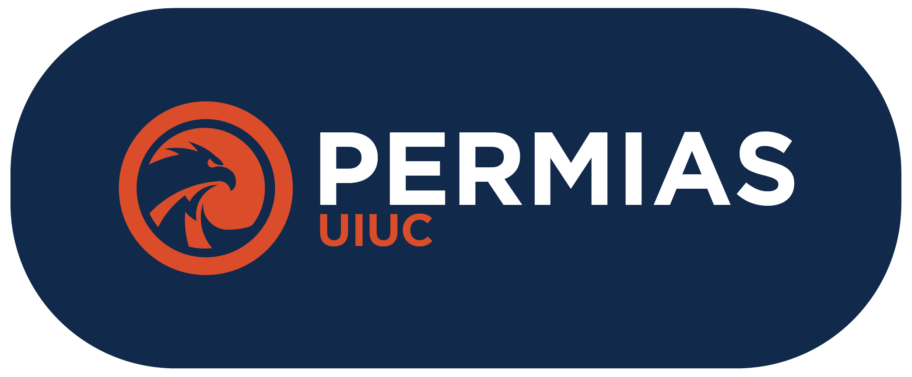

<div align="center">
    
    <p>Source code of a website for PERMIAS UIUC, an Indonesian student club in the University of Illinois Urbana-Champaign</p>
    <br>
</div>

## Local Development
```bash
# Cloning and installing dependencies
git clone https://github.com/JBWID/PermiasWebsite.git
npm install

# Running the Server
npm start
```